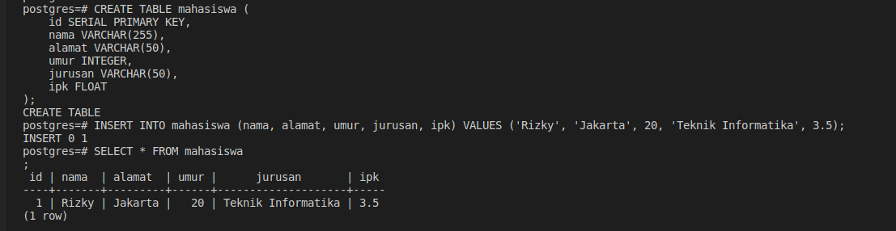
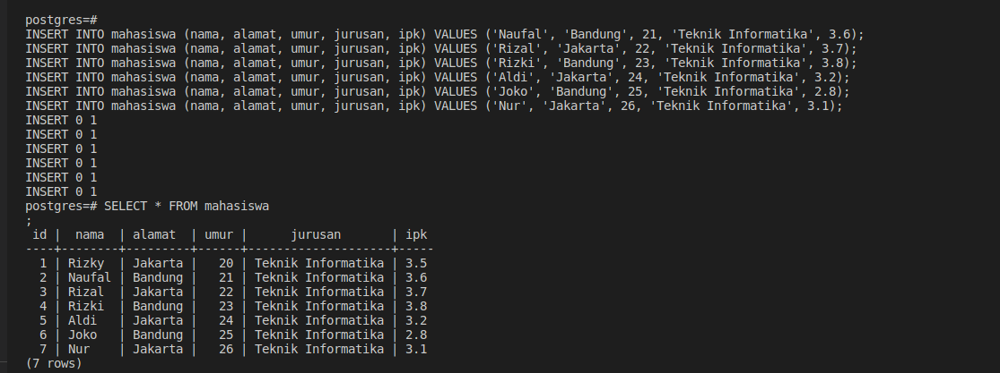
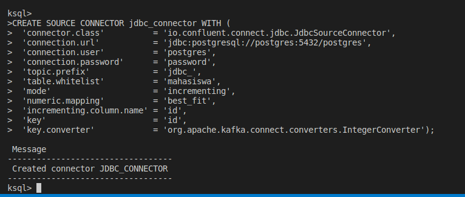
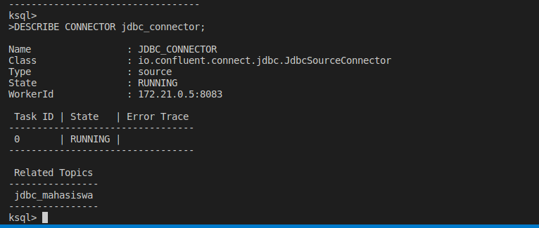
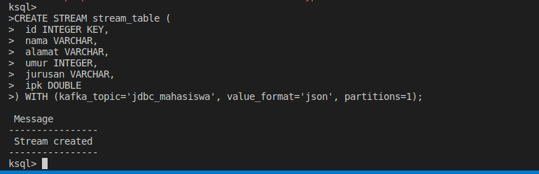
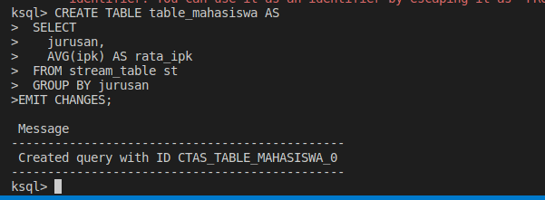
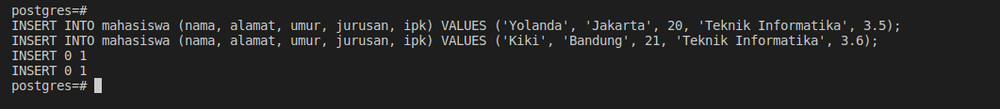
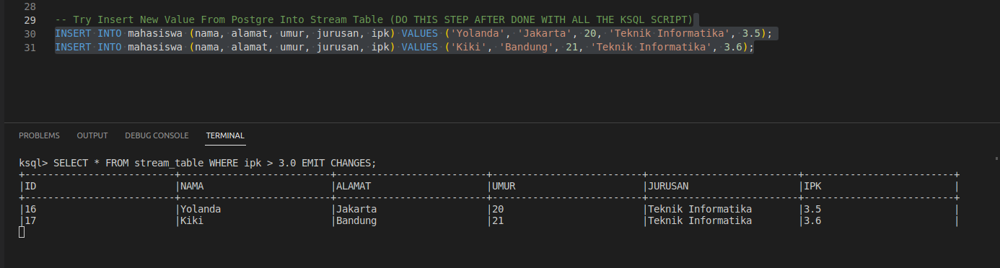
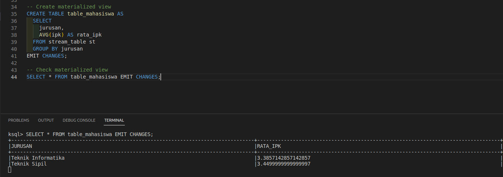

# 08-postgre-ksqldb-connectors

This repository contains examples of how to use the PostgreSQL and KSQLDB connectors with the Docker Compose.

## Prerequisites

### Download JDBC Connector
1. Download the zip file from [Confluent kafka-connect-JDBC](https://www.confluent.io/hub/confluentinc/kafka-connect-jdbc), and extract it into the same directory with the docker-compose.yml file.
2. Extract and rename the file into confuentinc-kafka-connect-jdbc
3. Config the docker-compose.yml file to mount the JDBC connector into the Kafka Connect container.

### How to run the examples (FULL script are also available in the respective files)
1. Run the docker-compose.yml file
```bash
docker-compose pull
docker-compose up -d
```
2. Enter the postgres container cli
```bash
docker exec -it postgres psql -U postgres
```
3. Create table and insert data into the table
```sql
CREATE TABLE mahasiswa (
    id SERIAL PRIMARY KEY,
    nama VARCHAR(255),
    alamat VARCHAR(50),
    umur INTEGER,
    jurusan VARCHAR(50),
    ipk FLOAT
);
```


```sql
# Insert data
INSERT INTO mahasiswa (nama, alamat, umur, jurusan, ipk) VALUES ('Rizky', 'Jakarta', 20, 'Teknik Informatika', 3.5);
INSERT INTO mahasiswa (nama, alamat, umur, jurusan, ipk) VALUES ('Naufal', 'Bandung', 21, 'Teknik Informatika', 3.6);
INSERT INTO mahasiswa (nama, alamat, umur, jurusan, ipk) VALUES ('Rizal', 'Jakarta', 22, 'Teknik Informatika', 3.7);
INSERT INTO mahasiswa (nama, alamat, umur, jurusan, ipk) VALUES ('Rizki', 'Bandung', 23, 'Teknik Informatika', 3.8);
INSERT INTO mahasiswa (nama, alamat, umur, jurusan, ipk) VALUES ('Aldi', 'Jakarta', 24, 'Teknik Informatika', 3.2);
INSERT INTO mahasiswa (nama, alamat, umur, jurusan, ipk) VALUES ('Rahmat', 'Bandung', 27, 'Teknik Sipil', 2.9);
INSERT INTO mahasiswa (nama, alamat, umur, jurusan, ipk) VALUES ('Rahman', 'Jakarta', 28, 'Teknik Sipil', 3.0);
INSERT INTO mahasiswa (nama, alamat, umur, jurusan, ipk) VALUES ('Rahmi', 'Bandung', 29, 'Teknik Sipil', 3.3);
INSERT INTO mahasiswa (nama, alamat, umur, jurusan, ipk) VALUES ('Rahma', 'Jakarta', 30, 'Teknik Sipil', 3.6);
INSERT INTO mahasiswa (nama, alamat, umur, jurusan, ipk) VALUES ('Rahim', 'Bandung', 31, 'Teknik Sipil', 3.9);
```


```sql
# Check data
SELECT * FROM mahasiswa;
```


4. Open another terminal and enter the Kafka Connect container cli
```bash
docker exec -it ksqldb-cli ksql http://ksqldb-server:8088
```

5. Create a connector to PostgreSQL
```bash

CREATE SOURCE CONNECTOR jdbc_connector WITH (
  'connector.class'          = 'io.confluent.connect.jdbc.JdbcSourceConnector',
  'connection.url'           = 'jdbc:postgresql://postgres:5432/postgres',
  'connection.user'          = 'postgres',
  'connection.password'      = 'password',
  'topic.prefix'             = 'jdbc_',
  'table.whitelist'          = 'mahasiswa',
  'mode'                     = 'incrementing',
  'numeric.mapping'          = 'best_fit',  
  'incrementing.column.name' = 'id',
  'key'                      = 'id',
  'key.converter'            = 'org.apache.kafka.connect.converters.IntegerConverter');

# Check connector
DESCRIBE CONNECTOR jdbc_connector;
```



6. Create a stream from the topic
```bash
# Create stream table
CREATE STREAM stream_table (
  id INTEGER KEY,
  nama VARCHAR,
  alamat VARCHAR,
  umur INTEGER,
  jurusan VARCHAR,
  ipk DOUBLE
) WITH (kafka_topic='jdbc_mahasiswa', value_format='json', partitions=1);
```



7. Create a table from the stream
```bash

# Create materialized view
CREATE TABLE table_mahasiswa AS
  SELECT
    jurusan,
    AVG(ipk) AS rata_ipk
  FROM stream_table st
  GROUP BY jurusan
EMIT CHANGES;
```



8. Open new terminal for the stream and to table to listen to the changes
```bash
# Stream
SELECT * FROM stream_table WHERE ipk > 3.0 EMIT CHANGES;

# Table
SELECT * FROM table_mahasiswa EMIT CHANGES;
```

9. Insert new data into the table
```sql
INSERT INTO mahasiswa (nama, alamat, umur, jurusan, ipk) VALUES ('Yolanda', 'Jakarta', 20, 'Teknik Informatika', 3.5);
INSERT INTO mahasiswa (nama, alamat, umur, jurusan, ipk) VALUES ('Kiki', 'Bandung', 21, 'Teknik Informatika', 3.6);
INSERT INTO mahasiswa (nama, alamat, umur, jurusan, ipk) VALUES ('Lala', 'Jakarta', 22, 'Teknik Informatika', 3.7);
INSERT INTO mahasiswa (nama, alamat, umur, jurusan, ipk) VALUES ('Lili', 'Bandung', 23, 'Teknik Informatika', 3.8);
INSERT INTO mahasiswa (nama, alamat, umur, jurusan, ipk) VALUES ('Lulu', 'Jakarta', 24, 'Teknik Informatika', 3.2);
INSERT INTO mahasiswa (nama, alamat, umur, jurusan, ipk) VALUES ('Laya', 'Bandung', 27, 'Teknik Sipil', 2.9);
```


10. Observe the changes in the stream and table


